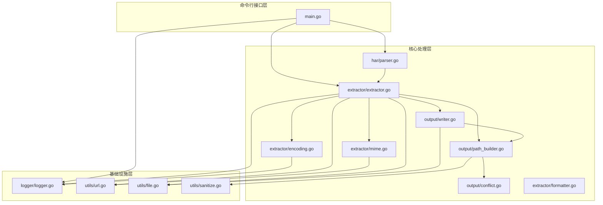
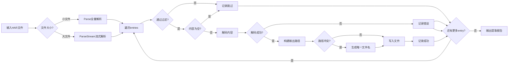
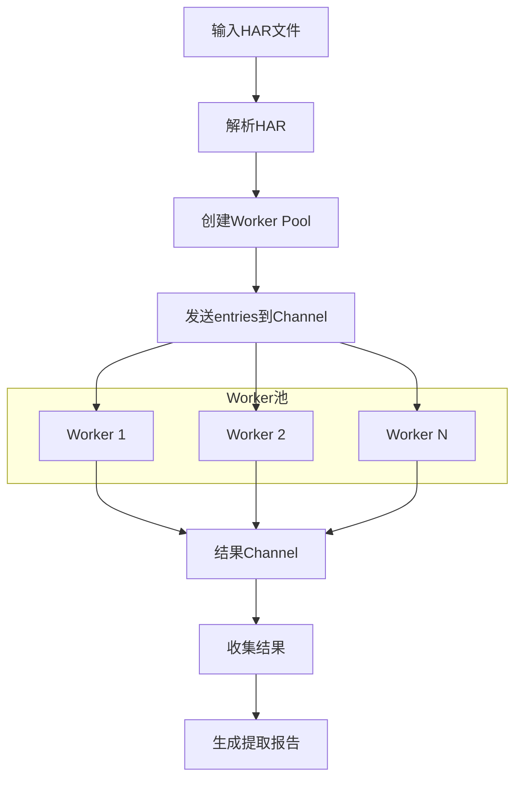

# HAR文件分离工具 - 架构设计文档

**版本**: 2.0  
**修订日期**: 2026-04-06  
**状态**: 已修订

---

## 1. 项目概述

本项目是一个Golang命令行工具，用于将浏览器导出的HAR（HTTP Archive）文件分离为独立的原始文件。

### 1.1 HAR文件结构分析

基于测试数据分析，HAR文件遵循[HAR 1.2规范](http://www.softwareishard.com/blog/har-12-spec/)，主要结构如下：

```
HAR文件结构
├── log
│   ├── version          # HAR版本（如"1.2"）
│   ├── creator          # 创建者信息
│   │   ├── name         # 工具名称
│   │   └── version      # 工具版本
│   ├── browser          # 浏览器信息
│   ├── pages            # 页面信息数组
│   └── entries          # HTTP请求条目数组
│       ├── startedDateTime  # 请求时间
│       ├── request          # 请求信息
│       │   ├── method       # HTTP方法
│       │   ├── url          # 请求URL
│       │   ├── headers      # 请求头数组
│       │   ├── cookies      # Cookie数组
│       │   └── queryString  # 查询参数数组
│       ├── response         # 响应信息
│       │   ├── status       # HTTP状态码
│       │   ├── statusText   # 状态文本
│       │   ├── headers      # 响应头数组
│       │   └── content      # 响应内容
│       │       ├── mimeType # MIME类型
│       │       ├── size     # 内容大小
│       │       ├── text     # 内容文本
│       │       └── encoding # 编码方式（base64等）
│       ├── cache            # 缓存信息
│       └── timings          # 时间信息
```

### 1.2 核心功能需求

1. **HAR文件解析**：解析JSON格式的HAR文件，支持流式解析处理大文件
2. **内容提取**：从每个entry中提取响应内容，支持并发处理
3. **文件保存**：根据URL路径结构保存文件，处理文件名冲突
4. **编码处理**：支持base64编码的二进制内容解码
5. **冲突处理**：处理同名文件的命名冲突，支持路径长度限制
6. **过滤功能**：支持MIME类型和HTTP状态码过滤

---

## 2. 项目架构

### 2.1 目录结构

```
har-decode/
├── cmd/
│   └── har-decode/
│       └── main.go              # 程序入口
├── internal/
│   ├── har/
│   │   ├── har.go               # HAR数据结构定义
│   │   ├── parser.go            # HAR解析器（支持流式解析）
│   │   └── parser_test.go       # 解析器测试
│   ├── extractor/
│   │   ├── extractor.go         # 文件提取器（支持并发）
│   │   ├── extractor_test.go    # 提取器测试
│   │   ├── encoding.go          # 编码处理
│   │   ├── mime.go              # MIME类型映射
│   │   └── formatter.go         # HTTP格式化器（完整HTTP信息输出）
│   ├── output/
│   │   ├── writer.go            # 文件写入器
│   │   ├── path_builder.go      # 路径构建器
│   │   └── conflict.go          # 文件名冲突处理
│   └── logger/
│       ├── logger.go            # 日志接口
│       └── zap_logger.go        # zap实现
├── pkg/
│   └── utils/
│       ├── url.go               # URL工具函数
│       ├── file.go              # 文件工具函数
│       └── sanitize.go          # 文件名清理
├── TestData/                    # 测试数据
├── docs/                        # 文档
├── go.mod
├── go.sum
├── build.bat                    # 编译脚本
└── README.md
```

### 2.2 模块依赖关系



---

## 3. 核心模块详细设计

### 3.1 HAR数据结构（internal/har/har.go）

```go
// HAR 文件根结构
type HAR struct {
    Log Log `json:"log"`
}

type Log struct {
    Version string   `json:"version"`
    Creator Creator  `json:"creator"`
    Browser Browser  `json:"browser,omitempty"`
    Pages   []Page   `json:"pages,omitempty"`
    Entries []Entry  `json:"entries"`
}

type Creator struct {
    Name    string `json:"name"`
    Version string `json:"version"`
}

type Browser struct {
    Name    string `json:"name"`
    Version string `json:"version"`
}

// Page 页面信息
type Page struct {
    StartedDateTime string      `json:"startedDateTime"`
    ID              string      `json:"id"`
    Title           string      `json:"title"`
    PageTimings     PageTimings `json:"pageTimings"`
}

// PageTimings 页面加载时间
type PageTimings struct {
    OnContentLoad float64 `json:"onContentLoad,omitempty"`
    OnLoad        float64 `json:"onLoad,omitempty"`
}

type Entry struct {
    StartedDateTime string   `json:"startedDateTime"`
    Request         Request  `json:"request"`
    Response        Response `json:"response"`
    Cache           Cache    `json:"cache"`
    Timings         Timings  `json:"timings"`
    Time            float64  `json:"time"`
    Pageref         string   `json:"pageref,omitempty"`
}

type Request struct {
    Method      string       `json:"method"`
    URL         string       `json:"url"`
    HTTPVersion string       `json:"httpVersion"`
    Headers     []Header     `json:"headers"`
    Cookies     []Cookie     `json:"cookies"`
    QueryString []QueryParam `json:"queryString"`
    BodySize    int          `json:"bodySize"`
}

type Response struct {
    Status      int        `json:"status"`
    StatusText  string     `json:"statusText"`
    HTTPVersion string     `json:"httpVersion"`
    Headers     []Header   `json:"headers"`
    Cookies     []Cookie   `json:"cookies"`
    Content     Content    `json:"content"`
    RedirectURL string     `json:"redirectURL"`
    HeadersSize int        `json:"headersSize"`
    BodySize    int        `json:"bodySize"`
}

type Content struct {
    MimeType string `json:"mimeType"`
    Size     int    `json:"size"`
    Text     string `json:"text,omitempty"`
    Encoding string `json:"encoding,omitempty"`
}

type Header struct {
    Name  string `json:"name"`
    Value string `json:"value"`
}

type Cookie struct {
    Name     string `json:"name"`
    Value    string `json:"value"`
    Path     string `json:"path,omitempty"`
    Domain   string `json:"domain,omitempty"`
    Expires  string `json:"expires,omitempty"`
    HTTPOnly bool   `json:"httpOnly,omitempty"`
    Secure   bool   `json:"secure,omitempty"`
}

type QueryParam struct {
    Name  string `json:"name"`
    Value string `json:"value"`
}

// Cache 缓存信息
type Cache struct {
    BeforeCache *CacheEntry `json:"beforeRequest,omitempty"`
    AfterCache  *CacheEntry `json:"afterRequest,omitempty"`
}

// CacheEntry 缓存条目
type CacheEntry struct {
    Expires    string `json:"expires,omitempty"`
    LastAccess string `json:"lastAccess"`
    ETag       string `json:"eTag"`
    HitCount   int    `json:"hitCount"`
}

// Timings 请求各阶段耗时
type Timings struct {
    Blocked  float64 `json:"blocked,omitempty"`
    DNS      float64 `json:"dns,omitempty"`
    Connect  float64 `json:"connect,omitempty"`
    Send     float64 `json:"send,omitempty"`
    Wait     float64 `json:"wait,omitempty"`
    Receive  float64 `json:"receive,omitempty"`
    SSL      float64 `json:"ssl,omitempty"`
}
```

### 3.2 解析器（internal/har/parser.go）

```go
package har

import (
    "encoding/json"
    "io"
    "os"
)

// Parser HAR解析器接口
type Parser interface {
    // Parse 从文件路径解析HAR（适合小文件）
    Parse(filePath string) (*HAR, error)
    // ParseFromBytes 从字节数组解析（适合已加载到内存的数据）
    ParseFromBytes(data []byte) (*HAR, error)
    // ParseStream 流式解析（适合大文件，内存友好）
    ParseStream(filePath string, entryHandler func(*Entry) error) error
}

type parser struct {
    logger logger.Logger
}

// NewParser 创建解析器实例
func NewParser(log logger.Logger) Parser {
    return &parser{logger: log}
}

func (p *parser) Parse(filePath string) (*HAR, error) {
    data, err := os.ReadFile(filePath)
    if err != nil {
        return nil, &Error{
            Code:    ErrInvalidFile,
            Message: "failed to read HAR file",
            Cause:   err,
        }
    }
    return p.ParseFromBytes(data)
}

func (p *parser) ParseFromBytes(data []byte) (*HAR, error) {
    var har HAR
    if err := json.Unmarshal(data, &har); err != nil {
        return nil, &Error{
            Code:    ErrParseFailed,
            Message: "failed to parse HAR JSON",
            Cause:   err,
        }
    }
    p.logger.Debug("HAR parsed successfully",
        logger.Field{Key: "entries", Value: len(har.Log.Entries)})
    return &har, nil
}

func (p *parser) ParseStream(filePath string, entryHandler func(*Entry) error) error {
    file, err := os.Open(filePath)
    if err != nil {
        return &Error{
            Code:    ErrInvalidFile,
            Message: "failed to open HAR file",
            Cause:   err,
        }
    }
    defer file.Close()

    decoder := json.NewDecoder(file)

    // 定位到entries数组
    for decoder.More() {
        token, err := decoder.Token()
        if err != nil {
            return err
        }
        if token == "entries" {
            break
        }
    }

    // 流式处理每个entry
    var entryCount int
    for decoder.More() {
        var entry Entry
        if err := decoder.Decode(&entry); err != nil {
            if err == io.EOF {
                break
            }
            return &Error{
                Code:    ErrParseFailed,
                Message: "failed to decode entry",
                Cause:   err,
            }
        }
        entryCount++
        if err := entryHandler(&entry); err != nil {
            return err
        }
    }

    p.logger.Info("Stream parsing completed",
        logger.Field{Key: "entries_processed", Value: entryCount})
    return nil
}
```

### 3.3 提取器（internal/extractor/extractor.go）

```go
package extractor

import (
    "sync"
    "har-decode/internal/har"
    "har-decode/internal/logger"
    "har-decode/internal/output"
)

// ExtractionStrategy 提取策略
type ExtractionStrategy int

const (
    StrategyContinueOnError ExtractionStrategy = iota  // 遇到错误继续处理后续entries
    StrategyStopOnFirstError                           // 遇到第一个错误立即停止
    StrategySkipEmptyContent                           // 跳过空内容条目
)

// ExtractConfig 提取配置
type ExtractConfig struct {
    OutputDir         string
    Strategy          ExtractionStrategy
    Workers           int                    // 并发worker数量，0表示使用CPU核心数
    FilterMimeTypes   []string               // MIME类型白名单（空表示全部）
    FilterStatusCodes []int                  // HTTP状态码白名单（空表示全部）
    Verbose           bool
}

// ExtractResult 单个entry的提取结果
type ExtractResult struct {
    URL          string
    OutputPath   string
    MimeType     string
    Size         int
    StatusCode   int
    Success      bool
    Skipped      bool          // 是否被过滤器跳过
    Error        error
}

// ExtractReport 提取报告
type ExtractReport struct {
    TotalEntries    int
    SuccessCount    int
    FailedCount     int
    SkippedCount    int
    FilteredCount   int    // 被过滤器排除的数量
    Results         []ExtractResult
    Errors          []ExtractError
}

// ExtractError 提取错误
type ExtractError struct {
    URL   string
    Phase string  // parse/decode/write
    Error error
}

// Extractor 提取器接口
type Extractor interface {
    Extract(har *har.HAR, config *ExtractConfig) (*ExtractReport, error)
    ExtractParallel(har *har.HAR, config *ExtractConfig) (*ExtractReport, error)
}

type extractor struct {
    writer      output.Writer
    decoder     ContentDecoder
    pathBuilder output.PathBuilder
    mimeMapper  MimeTypeMapper
    formatter   *HTTPFormatter      // HTTP格式化器
    logger      logger.Logger
}

// NewExtractor 创建提取器
func NewExtractor(
    writer output.Writer,
    decoder ContentDecoder,
    pathBuilder output.PathBuilder,
    mimeMapper MimeTypeMapper,
    log logger.Logger,
) Extractor {
    return &extractor{
        writer:      writer,
        decoder:     decoder,
        pathBuilder: pathBuilder,
        mimeMapper:  mimeMapper,
        formatter:   NewHTTPFormatter(),
        logger:      log,
    }
}

func (e *extractor) Extract(har *har.HAR, config *ExtractConfig) (*ExtractReport, error) {
    report := &ExtractReport{
        TotalEntries: len(har.Log.Entries),
        Results:      make([]ExtractResult, 0, len(har.Log.Entries)),
        Errors:       make([]ExtractError, 0),
    }

    for _, entry := range har.Log.Entries {
        result := e.processEntry(&entry, config)
        report.Results = append(report.Results, result)

        if result.Success {
            report.SuccessCount++
        } else if result.Skipped {
            report.SkippedCount++
        } else {
            report.FailedCount++
            report.Errors = append(report.Errors, ExtractError{
                URL:   entry.Request.URL,
                Phase: "extract",
                Error: result.Error,
            })
        }

        // 根据策略决定是否继续
        if result.Error != nil && config.Strategy == StrategyStopOnFirstError {
            break
        }
    }

    return report, nil
}

func (e *extractor) ExtractParallel(har *har.HAR, config *ExtractConfig) (*ExtractReport, error) {
    workers := config.Workers
    if workers <= 0 {
        workers = 4  // 默认4个worker
    }

    entriesChan := make(chan har.Entry, workers)
    resultsChan := make(chan ExtractResult, len(har.Log.Entries))

    var wg sync.WaitGroup

    // 启动worker池
    for i := 0; i < workers; i++ {
        wg.Add(1)
        go func() {
            defer wg.Done()
            for entry := range entriesChan {
                result := e.processEntry(&entry, config)
                resultsChan <- result
            }
        }()
    }

    // 发送任务
    go func() {
        for _, entry := range har.Log.Entries {
            entriesChan <- entry
        }
        close(entriesChan)
    }()

    // 等待完成并收集结果
    go func() {
        wg.Wait()
        close(resultsChan)
    }()

    // 汇总结果
    report := &ExtractReport{
        TotalEntries: len(har.Log.Entries),
        Results:      make([]ExtractResult, 0, len(har.Log.Entries)),
        Errors:       make([]ExtractError, 0),
    }

    for result := range resultsChan {
        report.Results = append(report.Results, result)
        if result.Success {
            report.SuccessCount++
        } else if result.Skipped {
            report.SkippedCount++
        } else {
            report.FailedCount++
        }
    }

    return report, nil
}

func (e *extractor) processEntry(entry *har.Entry, config *ExtractConfig) ExtractResult {
    result := ExtractResult{
        URL:        entry.Request.URL,
        StatusCode: entry.Response.Status,
        MimeType:   entry.Response.Content.MimeType,
        Size:       entry.Response.Content.Size,
    }

    // 状态码过滤
    if len(config.FilterStatusCodes) > 0 {
        allowed := false
        for _, code := range config.FilterStatusCodes {
            if entry.Response.Status == code {
                allowed = true
                break
            }
        }
        if !allowed {
            result.Skipped = true
            return result
        }
    }

    // MIME类型过滤
    if len(config.FilterMimeTypes) > 0 {
        allowed := false
        for _, mime := range config.FilterMimeTypes {
            if e.mimeMapper.Match(entry.Response.Content.MimeType, mime) {
                allowed = true
                break
            }
        }
        if !allowed {
            result.Skipped = true
            return result
        }
    }

    // 检查空内容
    if config.Strategy == StrategySkipEmptyContent &&
       (entry.Response.Content.Text == "" || entry.Response.Content.Size == 0) {
        result.Skipped = true
        return result
    }

    // 解码内容
    data, err := e.decoder.Decode(&entry.Response.Content)
    if err != nil {
        result.Error = err
        return result
    }

    // 构建输出路径
    pathResult, err := e.pathBuilder.Build(entry.Request.URL, entry.Response.Content.MimeType, config.OutputDir)
    if err != nil {
        result.Error = err
        return result
    }
    result.OutputPath = pathResult.ActualPath

    // 写入文件
    if err := e.writer.Write(data, pathResult.ActualPath); err != nil {
        result.Error = err
        return result
    }

    result.Success = true
    return result
}
```

### 3.4 HTTP格式化器（internal/extractor/formatter.go）

HTTP格式化器负责将HAR Entry格式化为可读的HTTP请求/响应文本，包含完整的请求头、查询参数、响应头和响应内容。

```go
package extractor

import (
    "fmt"
    "strings"
    "har-decode/internal/har"
)

// HTTPFormatter HTTP格式化器
type HTTPFormatter struct{}

func NewHTTPFormatter() *HTTPFormatter {
    return &HTTPFormatter{}
}

// FormatFullHTTP 格式化完整HTTP请求/响应信息
func (f *HTTPFormatter) FormatFullHTTP(entry *har.Entry, body string) string {
    var sb strings.Builder
    
    // ========== 请求部分 ==========
    sb.WriteString("========== HTTP REQUEST ==========\n\n")
    
    // 请求行
    sb.WriteString(fmt.Sprintf("%s %s %s\n",
        entry.Request.Method,
        entry.Request.URL,
        entry.Request.HTTPVersion))
    
    // 请求头
    sb.WriteString("\n--- Request Headers ---\n")
    for _, h := range entry.Request.Headers {
        sb.WriteString(fmt.Sprintf("%s: %s\n", h.Name, h.Value))
    }
    
    // 查询参数
    if len(entry.Request.QueryString) > 0 {
        sb.WriteString("\n--- Query Parameters ---\n")
        for _, q := range entry.Request.QueryString {
            sb.WriteString(fmt.Sprintf("%s: %s\n", q.Name, q.Value))
        }
    }
    
    // Cookies（如果有）
    if len(entry.Request.Cookies) > 0 {
        sb.WriteString("\n--- Request Cookies ---\n")
        for _, c := range entry.Request.Cookies {
            sb.WriteString(fmt.Sprintf("%s: %s\n", c.Name, c.Value))
        }
    }
    
    // ========== 响应部分 ==========
    sb.WriteString("\n========== HTTP RESPONSE ==========\n\n")
    
    // 状态行
    sb.WriteString(fmt.Sprintf("%s %d %s\n",
        entry.Response.HTTPVersion,
        entry.Response.Status,
        entry.Response.StatusText))
    
    // 响应头
    sb.WriteString("\n--- Response Headers ---\n")
    for _, h := range entry.Response.Headers {
        sb.WriteString(fmt.Sprintf("%s: %s\n", h.Name, h.Value))
    }
    
    // 响应Cookies（如果有）
    if len(entry.Response.Cookies) > 0 {
        sb.WriteString("\n--- Response Cookies ---\n")
        for _, c := range entry.Response.Cookies {
            sb.WriteString(fmt.Sprintf("%s: %s\n", c.Name, c.Value))
        }
    }
    
    // 响应内容
    sb.WriteString("\n--- Response Body ---\n")
    sb.WriteString(body)
    sb.WriteString("\n")
    
    return sb.String()
}
```

**输出格式示例：**

```
========== HTTP REQUEST ==========

GET https://example.com/api/data?id=123 HTTP/2

--- Request Headers ---
Host: example.com
User-Agent: Mozilla/5.0
Accept: application/json

--- Query Parameters ---
id: 123

========== HTTP RESPONSE ==========

HTTP/2 200 OK

--- Response Headers ---
Content-Type: application/json
Date: Sat, 25 Apr 2026 12:00:00 GMT

--- Response Body ---
{"status": "success", "data": {...}}
```

### 3.5 编码处理（internal/extractor/encoding.go）

```go
package extractor

import (
    "encoding/base64"
    "fmt"
    "har-decode/internal/har"
)

// EncodingType 编码类型
type EncodingType string

const (
    EncodingBase64 EncodingType = "base64"
    EncodingRaw    EncodingType = ""
)

// ContentDecoder 内容解码器接口
type ContentDecoder interface {
    Decode(content *har.Content) ([]byte, error)
    SupportsEncoding(encoding string) bool
}

type contentDecoder struct {
    supportedEncodings map[string]bool
}

// NewContentDecoder 创建解码器
func NewContentDecoder() ContentDecoder {
    return &contentDecoder{
        supportedEncodings: map[string]bool{
            "base64": true,
            "":       true,  // 无编码（纯文本）
        },
    }
}

func (d *contentDecoder) SupportsEncoding(encoding string) bool {
    return d.supportedEncodings[encoding]
}

func (d *contentDecoder) Decode(content *har.Content) ([]byte, error) {
    // 检查空内容
    if content.Text == "" {
        return nil, &har.Error{
            Code:    har.ErrEmptyContent,
            Message: "content text is empty",
        }
    }

    // 根据编码类型解码
    switch content.Encoding {
    case "base64":
        decoded, err := base64.StdEncoding.DecodeString(content.Text)
        if err != nil {
            return nil, &har.Error{
                Code:    har.ErrDecodeFailed,
                Message: "failed to decode base64 content",
                Cause:   err,
            }
        }
        return decoded, nil

    case "":
        // 纯文本，直接返回
        return []byte(content.Text), nil

    default:
        return nil, &har.Error{
            Code:    har.ErrDecodeFailed,
            Message: fmt.Sprintf("unsupported encoding: %s", content.Encoding),
        }
    }
}
```

### 3.6 MIME类型映射（internal/extractor/mime.go）

```go
package extractor

import (
    "path/filepath"
    "strings"
)

// MimeTypeMapper MIME类型映射器接口
type MimeTypeMapper interface {
    GetExtension(mimeType string) string
    Match(mimeType, pattern string) bool
}

type mimeTypeMapper struct {
    mimeToExt map[string]string
}

// NewMimeTypeMapper 创建MIME映射器
func NewMimeTypeMapper() MimeTypeMapper {
    return &mimeTypeMapper{
        mimeToExt: map[string]string{
            // 文本类型
            "text/html":                ".html",
            "text/css":                 ".css",
            "text/javascript":          ".js",
            "text/plain":               ".txt",
            "text/xml":                 ".xml",
            "text/csv":                 ".csv",
            "text/markdown":            ".md",

            // 应用类型
            "application/javascript":   ".js",
            "application/json":         ".json",
            "application/xml":          ".xml",
            "application/pdf":          ".pdf",
            "application/zip":          ".zip",
            "application/gzip":         ".gz",
            "application/wasm":         ".wasm",

            // 图片类型
            "image/jpeg":               ".jpg",
            "image/jpg":                ".jpg",
            "image/png":                ".png",
            "image/gif":                ".gif",
            "image/webp":               ".webp",
            "image/svg+xml":            ".svg",
            "image/x-icon":             ".ico",
            "image/vnd.microsoft.icon": ".ico",

            // 字体类型
            "font/woff":                ".woff",
            "font/woff2":               ".woff2",
            "font/ttf":                 ".ttf",
            "font/otf":                 ".otf",
            "application/font-woff":    ".woff",
            "application/font-woff2":   ".woff2",

            // 视频/音频类型
            "video/mp4":                ".mp4",
            "video/webm":               ".webm",
            "audio/mpeg":               ".mp3",
            "audio/wav":                ".wav",
        },
    }
}

func (m *mimeTypeMapper) GetExtension(mimeType string) string {
    // 清理MIME类型（移除charset等参数）
    cleanMime := strings.Split(mimeType, ";")[0]
    cleanMime = strings.TrimSpace(cleanMime)

    if ext, ok := m.mimeToExt[cleanMime]; ok {
        return ext
    }
    return ""
}

func (m *mimeTypeMapper) Match(mimeType, pattern string) bool {
    // 支持通配符匹配，如 "image/*"
    if strings.HasSuffix(pattern, "/*") {
        prefix := strings.TrimSuffix(pattern, "/*")
        return strings.HasPrefix(mimeType, prefix+"/")
    }
    return strings.EqualFold(mimeType, pattern)
}

// GetExtensionFromURL 从URL路径推断扩展名
func GetExtensionFromURL(url string) string {
    ext := filepath.Ext(url)
    if ext != "" {
        return ext
    }
    return ""
}
```

### 3.7 文件写入器（internal/output/writer.go）

```go
package output

import (
    "fmt"
    "os"
    "path/filepath"
)

// Writer 文件写入器接口
type Writer interface {
    Write(data []byte, path string) error
    Exists(path string) bool
    MkdirAll(path string) error
}

type writer struct{}

// NewWriter 创建写入器
func NewWriter() Writer {
    return &writer{}
}

func (w *writer) Write(data []byte, path string) error {
    // 确保目录存在
    dir := filepath.Dir(path)
    if err := w.MkdirAll(dir); err != nil {
        return fmt.Errorf("failed to create directory: %w", err)
    }

    // 写入文件
    if err := os.WriteFile(path, data, 0644); err != nil {
        return fmt.Errorf("failed to write file: %w", err)
    }

    return nil
}

func (w *writer) Exists(path string) bool {
    _, err := os.Stat(path)
    return !os.IsNotExist(err)
}

func (w *writer) MkdirAll(path string) error {
    return os.MkdirAll(path, 0755)
}
```

### 3.8 路径构建器（internal/output/path_builder.go）

```go
package output

import (
    "fmt"
    "net/url"
    "path/filepath"
    "strings"
    "har-decode/internal/logger"
    "har-decode/pkg/utils"
)

const (
    MaxPathLength = 250  // Windows MAX_PATH限制为260，留余量
    ConflictSuffixFormat = "_conflict%d"  // 冲突文件名后缀格式
)

// PathResult 路径构建结果
type PathResult struct {
    OriginalPath string  // 原始期望路径
    ActualPath   string  // 实际使用路径
    WasRenamed   bool    // 是否发生重命名
    RenameCount  int     // 重命名次数
}

// PathBuilder 路径构建器接口
type PathBuilder interface {
    Build(resourceURL, mimeType, outputDir string) (*PathResult, error)
}

type pathBuilder struct {
    mimeMapper MimeTypeMapper
    conflictResolver ConflictResolver
    logger     logger.Logger
}

// NewPathBuilder 创建路径构建器
func NewPathBuilder(mimeMapper MimeTypeMapper, resolver ConflictResolver, log logger.Logger) PathBuilder {
    return &pathBuilder{
        mimeMapper:       mimeMapper,
        conflictResolver: resolver,
        logger:           log,
    }
}

func (b *pathBuilder) Build(resourceURL, mimeType, outputDir string) (*PathResult, error) {
    result := &PathResult{}

    // 解析URL
    parsedURL, err := url.Parse(resourceURL)
    if err != nil {
        return nil, fmt.Errorf("failed to parse URL: %w", err)
    }

    // 构建基础路径
    var relativePath string
    if parsedURL.Path == "" || parsedURL.Path == "/" {
        // 根路径使用index.html
        relativePath = "index.html"
    } else {
        relativePath = parsedURL.Path

        // 移除开头的斜杠
        relativePath = strings.TrimPrefix(relativePath, "/")

        // URL解码
        decodedPath, err := url.PathUnescape(relativePath)
        if err == nil {
            relativePath = decodedPath
        }
    }

    // 清理文件名中的非法字符
    relativePath = utils.SanitizeFilePath(relativePath)

    // 如果没有扩展名，根据MIME类型添加
    if filepath.Ext(relativePath) == "" && mimeType != "" {
        ext := b.mimeMapper.GetExtension(mimeType)
        if ext != "" {
            relativePath += ext
        }
    }

    // 组合完整路径
    fullPath := filepath.Join(outputDir, relativePath)
    result.OriginalPath = fullPath

    // 检查路径长度限制
    if len(fullPath) > MaxPathLength {
        // 尝试缩短路径：使用哈希替代文件名
        shortenedPath := b.shortenPath(fullPath, MaxPathLength)
        b.logger.Warn("Path too long, shortened",
            logger.Field{Key: "original", Value: fullPath},
            logger.Field{Key: "shortened", Value: shortenedPath})
        fullPath = shortenedPath
    }

    // 处理文件名冲突
    actualPath, renamed, count := b.conflictResolver.Resolve(fullPath)
    result.ActualPath = actualPath
    result.WasRenamed = renamed
    result.RenameCount = count

    if renamed {
        b.logger.Debug("File name conflict resolved",
            logger.Field{Key: "original", Value: fullPath},
            logger.Field{Key: "actual", Value: actualPath})
    }

    return result, nil
}

func (b *pathBuilder) shortenPath(path string, maxLen int) string {
    // 使用MD5哈希缩短文件名
    dir := filepath.Dir(path)
    ext := filepath.Ext(path)
    base := filepath.Base(path)
    base = strings.TrimSuffix(base, ext)

    hash := utils.HashString(base)[:8]
    newName := hash + ext

    newPath := filepath.Join(dir, newName)
    if len(newPath) > maxLen && len(dir) > 10 {
        // 如果仍然太长，缩短目录名
        dir = dir[:maxLen-len(newName)-10] + "..."
        newPath = filepath.Join(dir, newName)
    }

    return newPath
}
```

### 3.9 文件名冲突处理（internal/output/conflict.go）

```go
package output

import (
    "fmt"
    "os"
    "path/filepath"
    "strings"
)

// ConflictResolver 文件名冲突解决器接口
type ConflictResolver interface {
    // Resolve 检查路径是否冲突，返回实际路径、是否重命名、重命名计数
    Resolve(path string) (actualPath string, wasRenamed bool, renameCount int)
    Reset()  // 重置内部状态
}

// conflictResolver 基于计数器的冲突解决器
type conflictResolver struct {
    usedPaths map[string]int  // 路径 -> 使用次数
}

// NewConflictResolver 创建冲突解决器
func NewConflictResolver() ConflictResolver {
    return &conflictResolver{
        usedPaths: make(map[string]int),
    }
}

func (r *conflictResolver) Resolve(path string) (string, bool, int) {
    // 检查路径是否已被使用
    count := r.usedPaths[path]
    r.usedPaths[path] = count + 1

    if count == 0 && !r.fileExists(path) {
        // 路径未被使用且文件不存在，直接使用
        return path, false, 0
    }

    // 需要重命名
    dir := filepath.Dir(path)
    ext := filepath.Ext(path)
    base := filepath.Base(path)
    base = strings.TrimSuffix(base, ext)

    // 生成带后缀的新文件名
    renameCount := count
    for {
        newName := fmt.Sprintf("%s_conflict%d%s", base, renameCount, ext)
        newPath := filepath.Join(dir, newName)

        if r.usedPaths[newPath] == 0 && !r.fileExists(newPath) {
            r.usedPaths[newPath] = 1
            return newPath, true, renameCount
        }

        renameCount++
        // 安全检查，防止无限循环
        if renameCount > 10000 {
            // 使用时间戳作为后缀
            newName = fmt.Sprintf("%s_%d%s", base, time.Now().UnixNano(), ext)
            return filepath.Join(dir, newName), true, renameCount
        }
    }
}

func (r *conflictResolver) fileExists(path string) bool {
    _, err := os.Stat(path)
    return !os.IsNotExist(err)
}

func (r *conflictResolver) Reset() {
    r.usedPaths = make(map[string]int)
}
```

### 3.10 日志系统（internal/logger/logger.go）

```go
package logger

// Field 日志字段
type Field struct {
    Key   string
    Value interface{}
}

// Logger 日志接口
type Logger interface {
    Debug(msg string, fields ...Field)
    Info(msg string, fields ...Field)
    Warn(msg string, fields ...Field)
    Error(msg string, fields ...Field)
    Fatal(msg string, fields ...Field)
}

// Level 日志级别
type Level int

const (
    DebugLevel Level = iota
    InfoLevel
    WarnLevel
    ErrorLevel
    FatalLevel
)
```

---

## 4. 错误处理

### 4.1 错误类型定义（internal/har/error.go）

```go
package har

import "fmt"

// ErrorCode 错误代码
type ErrorCode int

const (
    ErrInvalidFile ErrorCode = iota + 1
    ErrParseFailed
    ErrEmptyContent
    ErrDecodeFailed
    ErrWriteFailed
    ErrInvalidPath
    ErrPathTooLong
    ErrConflictResolution
)

// Error 自定义错误类型
type Error struct {
    Code    ErrorCode
    Message string
    Cause   error
}

func (e *Error) Error() string {
    if e.Cause != nil {
        return fmt.Sprintf("[%d] %s: %v", e.Code, e.Message, e.Cause)
    }
    return fmt.Sprintf("[%d] %s", e.Code, e.Message)
}

func (e *Error) Unwrap() error {
    return e.Cause
}
```

### 4.2 错误处理策略

| 错误场景     | 处理策略               | 说明                        |
| ------------ | ---------------------- | --------------------------- |
| 文件读取错误 | 终止程序               | HAR文件无法读取，无法继续   |
| JSON解析错误 | 终止程序               | 文件格式损坏，无法解析      |
| 内容解码错误 | 记录警告，跳过         | 单个entry损坏，继续处理其他 |
| 文件写入错误 | 记录错误，根据策略决定 | 磁盘满/权限问题             |
| 路径长度超限 | 自动缩短路径           | 使用哈希替代长文件名        |
| 文件名冲突   | 自动重命名             | 添加`_conflict{N}`后缀      |

---

## 5. 处理流程

### 5.1 串行处理流程



### 5.2 并行处理流程



---

## 6. 命令行接口设计

### 6.1 基本用法

```bash
# 基本用法
har-decode --input <har文件路径> --output <输出目录>

# 示例
har-decode --input ./TestData/example.har --output ./output

# 显示详细输出
har-decode --input ./TestData/example.har --output ./output --verbose

# 过滤特定MIME类型（支持通配符）
har-decode --input ./TestData/example.har --output ./output --filter "image/*,application/javascript"

# 过滤多个状态码（逗号分隔）
har-decode --input ./TestData/example.har --output ./output --status "200,301,302"

# 并发处理（指定worker数量）
har-decode --input ./TestData/example.har --output ./output --workers 8

# 遇到错误继续处理（默认）
har-decode --input ./TestData/example.har --output ./output --continue-on-error

# 遇到第一个错误停止
har-decode --input ./TestData/example.har --output ./output --stop-on-error

# 跳过空内容条目
har-decode --input ./TestData/example.har --output ./output --skip-empty

# 显示帮助
har-decode --help
```

### 6.2 命令行参数

| 长参数              | 简写 | 说明                                   | 默认值   | 是否必填 |
| ------------------- | ---- | -------------------------------------- | -------- | -------- |
| --input             | -i   | HAR文件路径                            | -        | 是       |
| --output            | -o   | 输出目录                               | ./output | 否       |
| --verbose           | -v   | 显示详细输出                           | false    | 否       |
| --filter            | -f   | MIME类型过滤（逗号分隔，支持\*通配符） | 全部     | 否       |
| --status            | -s   | HTTP状态码过滤（逗号分隔）             | 全部     | 否       |
| --workers           | -w   | 并发worker数量                         | 4        | 否       |
| --continue-on-error | -c   | 遇到错误继续处理                       | true     | 否       |
| --stop-on-error     | -    | 遇到第一个错误停止                     | false    | 否       |
| --skip-empty        | -    | 跳过空内容条目                         | false    | 否       |
| --help              | -h   | 显示帮助信息                           | -        | -        |
| --version           | -V   | 显示版本信息                           | -        | -        |

### 6.3 配置文件支持

支持从配置文件读取默认参数（可选）：

```yaml
# .har-decode.yaml
output: ./output
workers: 4
verbose: false
skip_empty: true
filter:
  - "image/*"
  - "application/javascript"
status:
  - 200
  - 304
```

配置文件查找顺序：

1. 当前目录 `.har-decode.yaml`
2. 用户主目录 `~/.har-decode.yaml`
3. 系统配置 `/etc/har-decode.yaml`

---

## 7. 测试策略

### 7.1 单元测试

| 测试模块             | 测试内容                                  |
| -------------------- | ----------------------------------------- |
| parser_test.go       | JSON解析正确性、流式解析、大文件处理      |
| encoding_test.go     | base64解码、文本处理、编码识别            |
| path_builder_test.go | URL到路径转换、特殊字符处理、路径长度限制 |
| conflict_test.go     | 文件名冲突解决、边界条件                  |
| mime_test.go         | MIME类型匹配、扩展名映射                  |

### 7.2 集成测试

- 使用TestData中的实际HAR文件进行端到端测试
- 验证输出文件的完整性和正确性
- 测试并发处理的正确性（无竞态条件）

### 7.3 边界条件测试

| 测试场景     | 描述                       |
| ------------ | -------------------------- |
| 空HAR文件    | 无entries的HAR文件         |
| 超大entry    | 单个entry内容超过100MB     |
| 特殊字符URL  | 包含中文、空格、emoji的URL |
| 同名文件冲突 | 超过1000个同名文件         |
| 超长路径     | 路径超过260字符            |
| 损坏的base64 | 不完整的base64编码内容     |
| 磁盘满       | 无可用空间时的处理         |
| 权限错误     | 无写入权限时的处理         |

### 7.4 性能测试

```go
// BenchmarkExtractLargeHAR 测试大文件处理性能
func BenchmarkExtractLargeHAR(b *testing.B) {
    // 测试100MB HAR文件
}

// BenchmarkExtractParallel 对比串行vs并行性能
func BenchmarkExtractParallel(b *testing.B) {
    for _, workers := range []int{1, 2, 4, 8, 16} {
        b.Run(fmt.Sprintf("workers_%d", workers), func(b *testing.B) {
            // 测试不同worker数量
        })
    }
}
```

---

## 8. 工具函数（pkg/utils/）

### 8.1 URL处理（utils/url.go）

```go
package utils

import (
    "net/url"
    "strings"
)

// ExtractHost 从URL提取主机名
func ExtractHost(rawURL string) (string, error) {
    u, err := url.Parse(rawURL)
    if err != nil {
        return "", err
    }
    return u.Host, nil
}

// IsValidURL 检查URL是否有效
func IsValidURL(rawURL string) bool {
    u, err := url.Parse(rawURL)
    return err == nil && (u.Scheme == "http" || u.Scheme == "https")
}
```

### 8.2 文件名清理（utils/sanitize.go）

```go
package utils

import (
    "path/filepath"
    "strings"
)

// Windows非法字符
var invalidChars = []string{"<", ">", ":", "\"", "/", "\\", "|", "?", "*"}

// SanitizeFileName 清理文件名中的非法字符
func SanitizeFileName(name string) string {
    result := name
    for _, char := range invalidChars {
        result = strings.ReplaceAll(result, char, "_")
    }
    // 移除控制字符
    result = strings.Map(func(r rune) rune {
        if r < 32 {
            return '_'
        }
        return r
    }, result)
    return result
}

// SanitizeFilePath 清理文件路径
func SanitizeFilePath(path string) string {
    parts := strings.Split(path, string(filepath.Separator))
    for i, part := range parts {
        parts[i] = SanitizeFileName(part)
    }
    return strings.Join(parts, string(filepath.Separator))
}

// HashString 计算字符串哈希（用于缩短长文件名）
func HashString(s string) string {
    // 使用MD5哈希
    import "crypto/md5"
    import "encoding/hex"

    hash := md5.Sum([]byte(s))
    return hex.EncodeToString(hash[:])
}
```

---

## 9. 依赖管理

```go
// go.mod
module har-decode

go 1.21

require (
    // 可选：如果使用cobra
    github.com/spf13/cobra v1.8.0
    github.com/spf13/viper v1.18.0  // 配置文件支持

    // 可选：如果使用zap日志
    go.uber.org/zap v1.26.0
)
```

**依赖决策**:

- 标准库`flag`足够时优先使用标准库
- 如需子命令、帮助生成、配置文件，使用`cobra+viper`
- 日志可使用标准库`log`或`zap`

---

## 10. 编译和运行

### 10.1 编译

```bash
# Windows
build.bat

# 或手动编译
go build -o bin/har-decode.exe ./cmd/har-decode

# 交叉编译 Linux
go build -o bin/har-decode-linux ./cmd/har-decode

# 交叉编译 MacOS
go build -o bin/har-decode-darwin ./cmd/har-decode
```

### 10.2 运行

```bash
./bin/har-decode --input ./TestData/example.har --output ./output
```

### 10.3 运行测试

```bash
# 运行所有测试
go test ./...

# 运行并生成覆盖率报告
go test -cover ./...

# 运行基准测试
go test -bench=. ./...
```

---

## 11. 扩展性考虑

### 11.1 未来功能扩展

1. **批量处理**: 支持通配符或目录批量处理多个HAR文件
2. **自定义模板**: 支持输出目录结构自定义模板（如按域名分组）
3. **请求提取**: 支持同时提取请求和响应内容
4. **提取报告**: 生成HTML/JSON格式的提取报告
5. **GUI界面**: 提供图形化界面版本
6. **HTTP服务**: 提供HTTP API接口

### 11.2 插件化接口

预留接口支持自定义扩展：

```go
// ContentProcessor 内容处理器接口
type ContentProcessor interface {
    Process(data []byte, mimeType string) ([]byte, error)
}

// PathGenerator 路径生成器接口（高级）
type PathGenerator interface {
    Generate(entry *har.Entry) (string, error)
}

// OutputFilter 输出过滤器接口
type OutputFilter interface {
    ShouldInclude(entry *har.Entry) bool
}
```

---

## 修订记录

| 版本 | 日期       | 修订内容                                                                 |
| ---- | ---------- | ------------------------------------------------------------------------ |
| 1.0  | 2026-04-06 | 初始版本                                                                 |
| 2.0  | 2026-04-06 | 补充缺失数据结构、完善接口设计、增加并发处理、添加日志系统、完善错误处理 |

---

**设计文档状态**: ✅ 已修订，可直接用于开发实现
